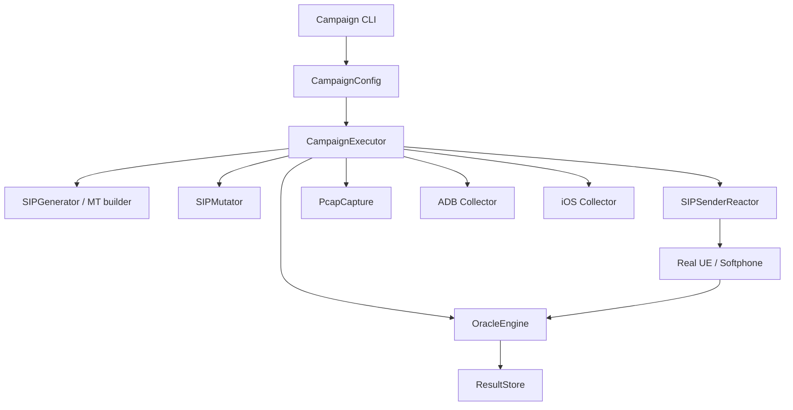

# Architecture

VolteMutationFuzzer runs SIP generation, mutation, delivery, observation, and
reporting as one campaign pipeline. The campaign CLI default is
`real-ue-direct`; the config model still supports `softphone`.



## Campaign Layer

`CampaignExecutor` owns the case loop:

1. build case tuple from method, response code, profile, layer, strategy, and seed
2. generate a SIP packet, render/build an MT packet, or read `--packet-file`
3. mutate through model, wire, or byte layer
4. send through the selected runtime mode
5. evaluate response and device evidence
6. persist JSONL result and reproduction metadata

`profile` and `mode` are independent:

- `profile` selects mutator policy and allowed concrete strategies
- `mode` selects sender/runtime path

`--strategy default` is resolved at execution time by `profile + layer + seed`.
Reports and replay should use the resolved concrete strategy.

## Case Generation

Default legacy campaigns use:

- profiles: `legacy`
- layers: `model`, `wire`, `byte`
- strategies: `default`, `state_breaker`

Template mode drops the `model` layer because it starts from rendered wire text.
Packet-file mode forces `byte` because the file is raw bytes and is sent
verbatim.

## Runtime Completeness

SIP method support is split into runtime and generator truth:

| Scope | Methods |
| --- | --- |
| `runtime_complete + real_ue_baseline` | `INVITE` |
| `runtime_complete + invite_dialog` | `ACK`, `BYE`, `CANCEL`, `INFO`, `PRACK`, `REFER`, `UPDATE` |
| `runtime_complete + stateless` | `MESSAGE`, `OPTIONS`, `SUBSCRIBE` |
| `generator_complete + generator_only` | `NOTIFY`, `PUBLISH`, `REGISTER` |

`runtime_complete` does not automatically mean real-device validated. Use
`docs/reference/sip-completeness.md` when documenting or changing this contract.

## Generation Paths

- Standard path: `SIPGenerator` builds structured SIP requests/responses.
- MT INVITE path: `--mt` renders the bundled `mt_invite_3gpp.sip.tmpl`
  template.
- MT non-INVITE path: `build_mt_packet()` or `build_mt_packet_bytes()` builds
  real-UE oriented packets for methods such as `MESSAGE`.
- Packet-file path: `--packet-file` reads raw bytes and bypasses generator and
  slot substitution.

## Mutator Layer

The mutation engine accepts either structured packet models or editable wire
messages and returns a mutated case plus metadata.

Mutation layers:

- `model`: SIP model/field mutation
- `wire`: text-level SIP mutation, including SDP-aware strategies
- `byte`: raw byte-level mutation and targeted byte offsets

Profiles:

- `legacy`
- `delivery_preserving`
- `ims_specific`
- `parser_breaker`
- `pixel_ims`
- `iphone_ims`

Concrete strategy allow-lists live in
`src/volte_mutation_fuzzer/mutator/profile_catalog.py`.

## Sender Layer

`SIPSenderReactor` supports:

- `real-ue-direct`: default campaign CLI path
- `softphone`: local/direct UDP or TCP path

Real-UE delivery resolves live target state instead of relying on fixed device
slots:

1. MSISDN to UE IP from `kamctl`, P-CSCF logs, xfrm state, or explicit
   `VMF_MSISDN_TO_IP_<MSISDN>`
2. protected ports from `Security-Client` and xfrm `dport` mapping
3. route/readiness checks
4. `native`, `null`, or `bypass` IPsec mode execution

`native` sends from the P-CSCF namespace through negotiated IPsec/xfrm. `null`
and `bypass` are explicit plaintext or policy-bypass experiment modes.

## Oracle And Evidence

Verdicts:

| Verdict | Meaning |
| --- | --- |
| `normal` | 1xx/2xx SIP response and no device anomaly |
| `suspicious` | 4xx/5xx response or protocol-level anomaly |
| `timeout` | no response within timeout |
| `crash` | target process/device crash indicator |
| `stack_failure` | ADB or iOS log/crash-report anomaly |

Evidence sources:

- SIP response and observer events
- `results.jsonl`
- `pcap/`
- `interesting/case_<id>/`
- Android logcat/bugreport/screenshot snapshots
- iOS syslog/crash report snapshots
- generated HTML report

Native IPsec runs may show ESP externally, so observer events and campaign
responses are the primary evidence, not plain SIP visibility in pcap.

## Storage

Campaign output is JSONL under the campaign directory. Reporting and replay
consume that same JSONL contract:

```bash
uv run fuzzer campaign report <results.jsonl>
uv run fuzzer campaign replay <results.jsonl> --case-id <id>
```
