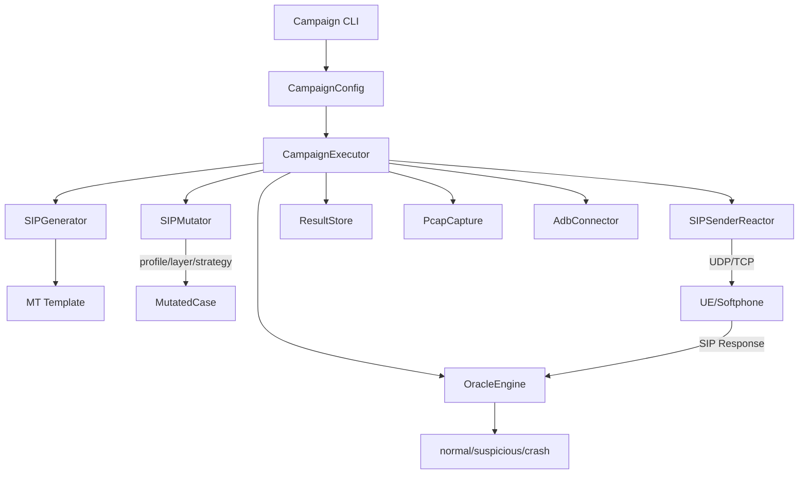

# VolteMutationFuzzer 시스템 아키텍처

## 📐 전체 구조



## 🏗️ 주요 구성 요소

### Packet Completeness / Runtime Honesty

SIP 요청 메서드 지원은 단순히 "구현됨"으로 읽지 않는다. 현재 아키텍처는 메서드별 완성도를 아래 축으로 분리한다.

- `runtime_complete`: 현재 저장소 안에서 honest runtime path 가 있어 campaign/dialog/runtime 검증이 가능한 메서드
- `generator_complete`: coherent generation/mutation 은 있지만, runtime prerequisite state 를 저장소가 아직 소유하지 않는 메서드

여기서 `runtime_complete`는 자동으로 "real-device validated"를 뜻하지 않는다. 실제 의미는 `baseline_scope`에 따라 갈린다.

- `real_ue_baseline`: 실제 UE 기준 baseline 이 있는 범위. 현재 `INVITE`만 해당
- `invite_dialog`: INVITE로 honest state 를 세운 뒤 다이얼로그 내부에서 검증하는 범위
- `stateless`: 별도 dialog setup 없이 직접 runtime path 를 태우는 범위
- `generator_only`: generator/render/mutation 기준으로만 정직하게 말할 수 있는 범위

현재 기준:

- `INVITE`는 `runtime_complete + real_ue_baseline`
- `ACK/BYE/CANCEL/INFO/PRACK/REFER/UPDATE`는 `runtime_complete + invite_dialog`
- `MESSAGE/OPTIONS`는 `runtime_complete + stateless`
- `NOTIFY/PUBLISH/REGISTER/SUBSCRIBE`는 `generator_complete + generator_only`

### 1. Campaign Layer (캠페인 실행)

#### `CampaignExecutor`
- **역할**: 전체 퍼징 루프 관리 (generate → mutate → send → judge → store)
- **핵심 메서드**:
  - `execute()`: 메인 실행 루프
  - `_execute_case()`: 단일 케이스 실행  
  - `_execute_mt_template_case()`: MT template 전용 경로
- **특징**: softphone과 real-ue-direct 모드 분기 처리

#### `CaseGenerator`
- **역할**: 테스트 케이스 조합 생성 (method × profile × layer × strategy)
- **지원 조합**:
  ```python
  methods: OPTIONS, INVITE, MESSAGE, REGISTER, ...
  profiles: legacy, delivery_preserving, ims_specific, parser_breaker
  layers: model, wire, byte
  strategies: identity, default, safe, header_targeted,
              header_whitespace_noise, final_crlf_loss,
              duplicate_content_length_conflict, tail_chop_1,
              tail_garbage, alias_port_desync, state_breaker
  ```
  - `profile`은 mutator 정책 축이고, `mode`는 실행 경로 축이다.
  - 둘은 서로 독립적이지만, `mode`에 따라 생성/변이/송신 흐름이 달라질 수 있다.
  - 예를 들어 `real-ue-direct`는 MT template 렌더링과 real-UE resolver를 포함하고, `softphone`는 일반 PacketModel 경로를 사용한다.

#### `CampaignConfig`
- **역할**: 전체 설정 중앙화 + validation
- **핵심 기능**: MSISDN → UE IP 자동 resolve

### 2. Generator Layer (패킷 생성)

#### `SIPGenerator`
- **역할**: 구조적 SIP 패킷 생성 (model layer용)
- **방식**: PacketModel → 렌더링 → wire text
- **완성도 해석**: `generator_complete` 메서드도 여기서는 생성 가능하지만, 그것만으로 honest runtime support 를 의미하지는 않는다.

#### `MT Template System`
- **파일**: `generator/templates/mt_invite_a31.sip.tmpl`
- **역할**: 실제 capture 기반 완전한 3GPP MT-INVITE 생성
- **슬롯**: 18개 동적 매개변수 (IMPI, port_pc/port_ps, Call-ID 등)
- **렌더링**: `build_default_slots()` → `render_mt_invite()`
- **범위**: 현재 real-UE baseline 주력 경로는 `INVITE`다. 비-INVITE 메서드도 MT packet builder 경로는 존재하지만, 각 메서드의 honest claim 범위는 completeness registry의 `baseline_scope`로 읽어야 한다.

### 3. Mutator Layer (변이 엔진)

#### 변이 레이어 구조
```
Original Input
     ↓
┌─ model ─┐  ┌─ wire ─┐  ┌─ byte ─┐
│ PacketModel │ → │ SIP Text │ → │ Raw Bytes │
│   변이      │   │   변이   │   │    변이    │
└─────────┘   └─────────┘   └──────────┘
     ↓             ↓            ↓
   Model         Wire          Byte
  MutatedCase   MutatedCase   MutatedCase
```

#### `SIPMutator`
- **`mutate()`**: PacketModel 입력 (기존)
- **`mutate_editable()`**: EditableSIPMessage 입력 (MT template용)

#### 변이 전략
이 표는 개념 요약이며, 실제로 선택 가능한 concrete strategy는 `profile`과 `layer`에 따라 달라진다.

| Strategy | 설명 | 용도 |
|----------|------|------|
| **identity** | 원본을 그대로 유지하는 baseline 전략 | 연결성 확인, oracle baseline |
| **default** | profile이 layer별 기본 concrete strategy를 해석하도록 요청하는 전략 | 일반 퍼징, profile-aware 기본값 |
| **safe** | 전달 가능성을 최대한 보존하는 완화된 변이 | delivery_preserving 계열 |
| **header_targeted** | 특정 헤더를 중심으로 바이트 변이를 유도 | byte layer의 표적 변이 |
| **header_whitespace_noise** | 헤더 주변 공백/탭을 흔드는 wire 변이 | parser/proxy 경계 테스트 |
| **final_crlf_loss** | 마지막 CRLF를 손상시키는 wire 변이 | parser_breaker 계열 |
| **duplicate_content_length_conflict** | 상충하는 Content-Length를 만드는 wire 변이 | parser_breaker 계열 |
| **tail_chop_1** | 마지막 1바이트를 잘라내는 byte 변이 | tail truncation 재현 |
| **tail_garbage** | 짧은 suffix를 덧붙이는 byte 변이 | parser confusion 유도 |
| **alias_port_desync** | IMS alias/port 정합성을 비트는 wire 변이 | IMS-specific 경로 |
| **state_breaker** | 상태 기반 공격 변이 | model layer의 고급 시나리오 |

### 4. Sender Layer (송신 엔진)

#### `SIPSenderReactor`
- **역할**: 다양한 전송 방식 통합
- **지원 모드**:
  - `softphone`: 직접 UDP/TCP 송신
  - `real-ue-direct`: UE 대상 특수 처리와 template/resolve-driven 흐름

#### Real-UE-Direct 경로
```python
# IPsec 모드에 따른 분기
if ipsec_mode == "null":
    # Host에서 직접 IP spoofing
    _send_with_spoofed_source(source_ip="172.22.0.21")
elif ipsec_mode == "bypass":  
    # Docker exec으로 P-CSCF netns 진입
    _send_via_container(container="pcscf")
```

#### `RealUEDirectResolver`
- **역할**: 동적 UE 정보 resolve
- **기능**:
  - `resolve_protected_ports()`: port_pc/port_ps 실시간 조회
  - `resolve_ue_ip_from_msisdn()`: MSISDN → IP 매핑

real-ue-direct 는 현재 문서 기준에서 "모든 runtime_complete 메서드가 실기기에서 동일 수준으로 검증되었다"는 뜻이 아니다. 실기기 baseline 은 `INVITE`이고, 나머지 runtime-complete 메서드는 주로 stateless 또는 invite-dialog smoke/runtime 경로로 정직하게 설명해야 한다.

### 5. Oracle Layer (응답 판정)

#### `OracleEngine`
- **역할**: SIP 응답을 verdict로 분류
- **판정 로직**:
  ```python
  def evaluate(send_result, context) -> OracleVerdict:
      if process_crashed:
          return "crash"
      if stack_trace_found:
          return "stack_failure"  
      if timeout_exceeded:
          return "timeout"
      if error_response(4xx, 5xx):
          return "suspicious"
      if success_response(1xx, 2xx):
          return "normal"
  ```

#### 통합 Oracle (ADB + Process + Log)
- **AdbAnomalyDetector**: Android logcat 분석
- **ProcessOracle**: 프로세스 생존 확인  
- **LogOracle**: 애플리케이션 로그 분석

### 6. Storage Layer (결과 저장)

#### `ResultStore`
- **형식**: JSONL (JSON Lines)
- **구조**:
  ```json
  {"campaign_id": "...", "config": {...}, "summary": {...}}
  {"case_id": 0, "verdict": "normal", "elapsed_ms": 1523, ...}
  {"case_id": 1, "verdict": "suspicious", "reason": "400 Bad Request", ...}
  ```

#### `PcapCapture`
- **기능**: tcpdump 자동 실행/종료
- **파일명**: `case_XXXXXX.pcap`
- **인터페이스**: `br-volte` (Docker 내부 통신 포함)

#### `AdbConnector` 
- **트리거**: crash/stack_failure 감지 시
- **수집 데이터**: logcat, bugreport, screenshot
- **저장 위치**: `results/adb_snapshots/case_XXXXXX/`

## 🔄 데이터 흐름

### 1. Softphone 모드 (기본)
```
CLI Input → CampaignConfig → TargetEndpoint{host, port}
    ↓
CaseGenerator → (method, profile, layer, strategy) combinations
    ↓  
SIPGenerator → PacketModel → SIPMutator → MutatedCase
    ↓
SIPSenderReactor → UDP/TCP direct send → SoftPhone
    ↓
OracleEngine → Verdict → ResultStore
```

이 경로는 현재 `stateless` 메서드와 `invite_dialog` 메서드의 honest smoke/runtime 검증에 주로 사용된다.

### 2. Real-UE-Direct 모드 (A31)
```
CLI Input{target_msisdn} → resolve_ue_ip → CampaignConfig{target_host}
    ↓
resolve_protected_ports() → port_pc/port_ps (dynamic)
    ↓
MT Template + slots → render_mt_invite() → wire_text
    ↓
parse_editable_from_wire() → EditableSIPMessage
    ↓
SIPMutator.mutate_editable() → MutatedWireCase
    ↓
ipsec_mode routing:
  - null: _send_with_spoofed_source() 
  - bypass: _send_via_container()
    ↓
A31 UE → SIP Response → OracleEngine + AdbConnector
    ↓
Verdict + ADB snapshot → ResultStore + PcapCapture
```

이 경로에서 가장 강한 baseline 은 `INVITE`다. `INFO`의 경우 invite-dialog 경로에서 기본 `info_package=dtmf`를 사용하며, real-ue-direct packet generation도 DTMF body를 실제 wire에 materialize 한다. `REFER`는 명시적으로 body를 덮어쓰지 않는 한 기본적으로 bodyless 로 유지된다. `PRACK`는 "임의의 18x"가 아니라 `Require: 100rel` 과 `RSeq`가 있는 reliable provisional response 에 의존한다.

## 🎛️ 설정 시스템

### 계층 구조
```
CLI Options
    ↓ 
CampaignConfig (validation + defaults)
    ↓
TargetEndpoint (auto-resolution + validation)
    ↓
실제 실행 컴포넌트들
```

`profile`과 `mode`는 서로 독립적이다. `profile`은 mutator가 어떤 변이 규칙과 기본 concrete strategy를 선택할지 정하고, `mode`는 sender와 주변 실행 흐름이 어떤 경로를 사용할지 정한다.

### 자동 Resolution 체인
```python
# 1단계: MSISDN → UE IP
target_msisdn="111111" → resolve_ue_ip → target_host="10.20.20.8"

# 2단계: UE IP → 동적 포트  
target_host="10.20.20.8" → resolve_protected_ports → port_pc=8100

# 3단계: IPsec 모드 → 송신 방식
ipsec_mode="null" → source_ip="172.22.0.21", bind_container=None
```

## 🔧 핵심 알고리즘

### Port Resolution (동적 포트 조회)
```python
def resolve_protected_ports(msisdn: str) -> tuple[int, int]:
    # Strategy 1: Kamailio logs
    logs = docker_logs("pcscf", since="5m")
    matches = re.findall(r"Port is (\d+)", logs)
    if matches:
        port_pc = int(matches[-1])  # 최근 매치
        return port_pc, port_pc + 1
    
    # Strategy 2: xfrm state parsing
    xfrm_output = docker_exec("pcscf", "ip", "xfrm", "state")
    ue_sports = parse_ue_sports(xfrm_output, "10.20.20.8")
    port_pc = min(ue_sports)
    return port_pc, port_pc + 1
```

### Template Rendering (슬롯 치환)
```python
def render_mt_invite(template: str, slots: MTInviteSlots) -> str:
    # 1. 슬롯 치환
    text = template.replace("{{impi}}", slots.impi)
    text = text.replace("{{request_uri_port_pc}}", str(slots.port_pc))
    # ... 18개 슬롯 처리
    
    # 2. Content-Length 계산
    header, body = text.split("\r\n\r\n", 1)
    content_length = len(body.encode("utf-8"))
    text = text.replace("{{content_length}}", str(content_length))
    
    # 3. CRLF 정규화
    return normalize_crlf(text)
```

### Fragment Guard (단편화 방지)
```python
def check_fragmentation(payload: bytes, ipsec_mode: str) -> bool:
    if ipsec_mode == "null" and len(payload) > 1400:
        # Host → LTE 경로: IP 단편화 치명적
        return False  # TCP 사용 권장
    elif ipsec_mode == "bypass":
        # Docker 내부망: IP 단편화 안전
        return True
```

## 🛡️ 에러 처리 및 복구

### Graceful Degradation
- **포트 조회 실패**: 기본 포트 (5060) fallback  
- **MSISDN 매핑 실패**: 명확한 에러 메시지 + 환경변수 가이드
- **Template 렌더링 실패**: leftover `{{...}}` 검출

### Timeout 처리
- **Socket timeout**: 개별 케이스 레벨 timeout
- **Campaign timeout**: 전체 실행 시간 제한 (옵션)
- **Process timeout**: docker exec, adb 명령어별 timeout

### 리소스 정리
- **PcapCapture**: exception 발생해도 tcpdump 프로세스 종료
- **Container exec**: subprocess cleanup
- **ADB 연결**: device 연결 해제

## 📊 성능 특성

### 처리량
- **Softphone**: ~100 cases/minute (네트워크 속도 제한)
- **Real-UE-Direct**: ~30 cases/minute (UE 응답 지연 + 복잡한 처리)

### 확장성 제약
- **단일 UE**: 동시 다중 세션 불가 (IMS 등록 충돌)
- **Docker exec**: 프로세스 생성 오버헤드  
- **ADB**: 단일 device 연결만 안정적

### 메모리 사용
- **Template 캐싱**: 첫 로드 후 메모리 보관
- **Pcap 버퍼링**: 케이스별 파일 분리로 메모리 절약
- **Oracle 상태**: verdict 평가는 per-case 중심으로 유지되지만, campaign/dialog 경로는 같은 케이스 안에서 INVITE 기반 dialog state를 세워서 `ACK/BYE/CANCEL/INFO/PRACK/REFER/UPDATE` 같은 runtime-complete 메서드를 검증할 수 있다.

---

## 🔮 확장 방향

1. **다중 UE 지원**: IMPI 기반 동시 퍼징
2. **Dialog 확장**: 현재 invite-dialog/runtime-complete 범위를 넘어서 SUBSCRIBE/NOTIFY, REGISTER, PUBLISH 같은 prerequisite-state 경로를 honest runtime path 로 넓히기
3. **SDP 전용 mutator**: 미디어 협상 집중 공격
4. **ML 기반 oracle**: 응답 패턴 학습을 통한 anomaly 감지
5. **분산 실행**: 여러 host에서 병렬 캠페인 실행

이 아키텍처는 **확장 가능하고 모듈화된 설계**를 통해 다양한 VoLTE/IMS 퍼징 시나리오를 지원합니다.
